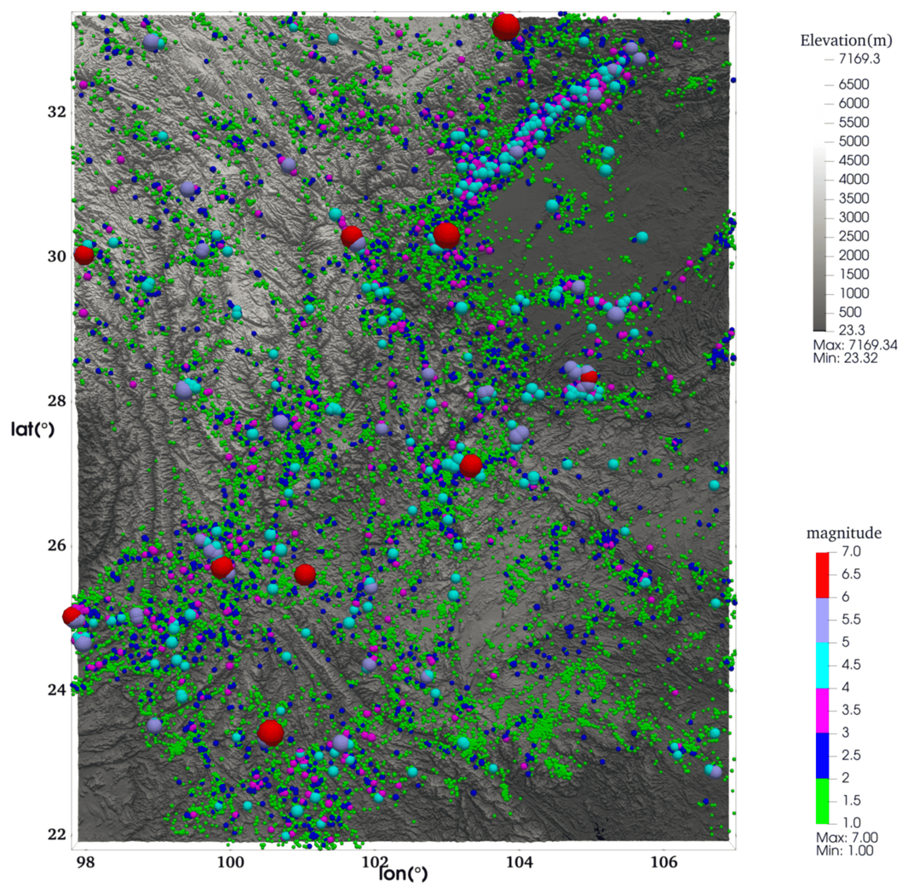
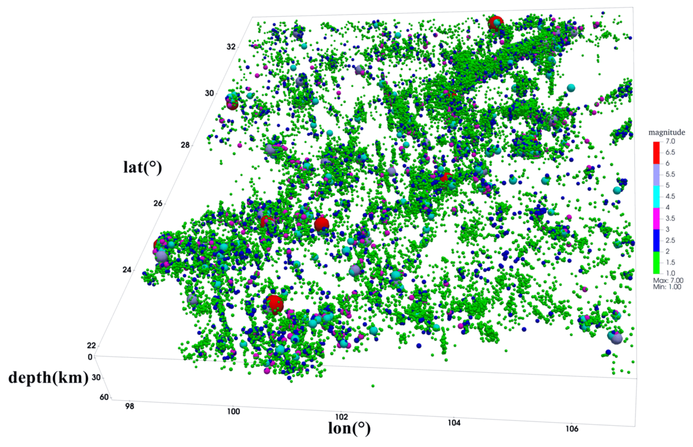
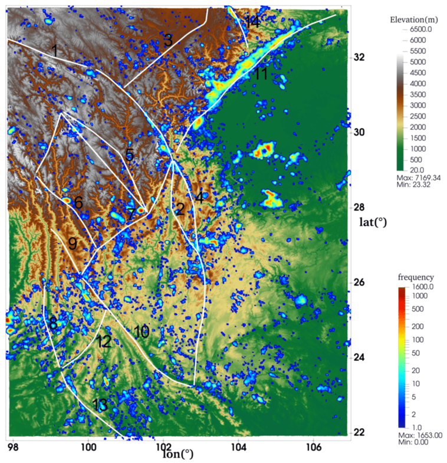
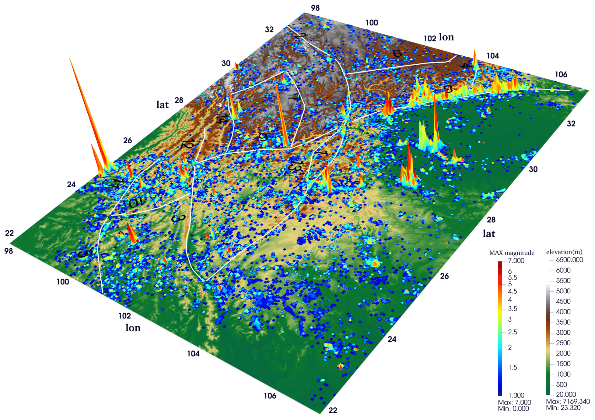
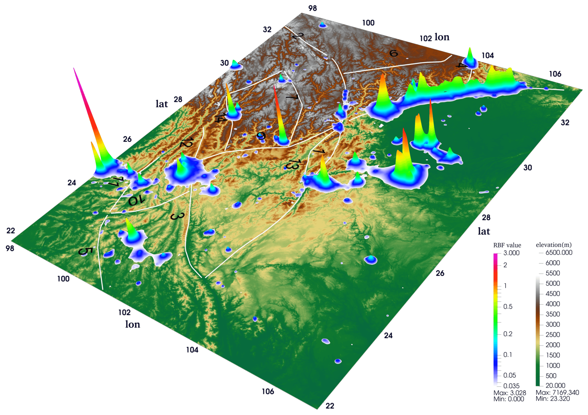
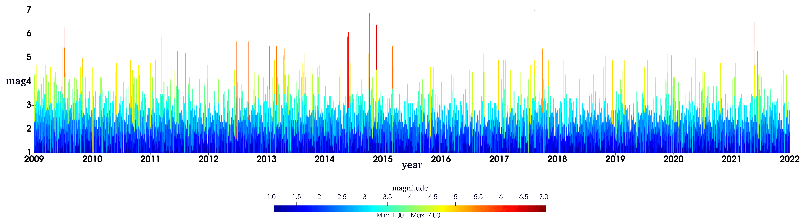
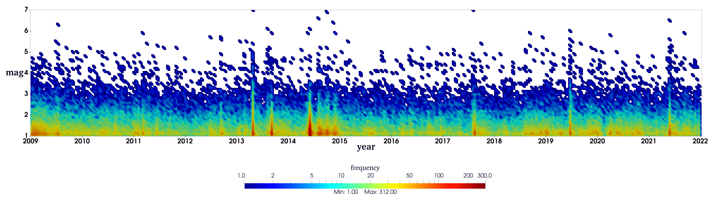

## 地震目录可视化小脚本，主要实现以下几种地震图的绘制：

### 1、地震散点图：

   
  二维散点图

   
  三维散点图

### 2、地震热力图：

   
  地震热力图

#### 主要活动断裂名称：1-daliangshan fault, 2-ganzi fault, 3-honghe fault, 4-huya fault, 5-lancang fault, 6-lijiang_xiaojinhe fault, 7-litang_batang fault, 8-longmenshan fault, 9-longriba fault, 10-nantinghe fault, 11-nujiang fault, 12-weixi_qiaohou fault, 13-xianshuihe_to_xiaojiang fault, 14-zhongdian fault. （数据来源: https://210.72.25.135/cfm3d/achievement/achievements-list/190-2023-12-15-08-43-16）

### 3、M-F图

   
  M-F图

   
  改进的M-F图

### 4、M-T图

   
  M-T图

   
  改进的M-T图

##### If you have any question or comments, please feel free to contact me at  hexypei@gmail.com.
