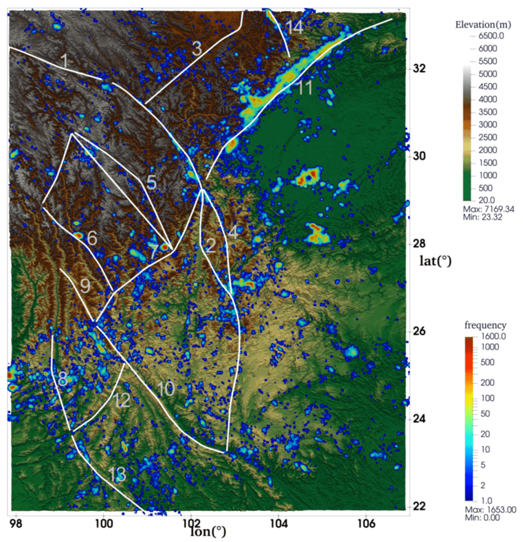
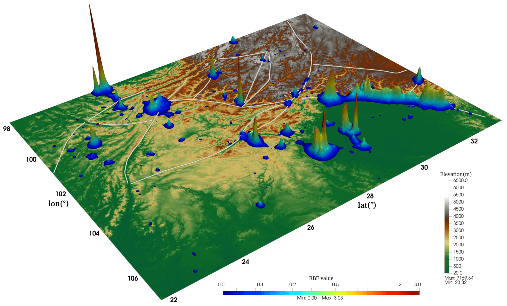

## 地震目录可视化小脚本，主要实现以下几种地震图的绘制：

### 1、散点图：

   
  二维散点球

   
  三维散点球

### 2、热力图：

   
  热力图1

   
  热力图2

#### 主要活动断裂名称：1-ganzi; 2-xianshuihe; 3-longriba; 4-daliangshan; 5-litang; 6-zhongdian; 7-lijiang; 8-nujiang; 9-weixi; 10-honghe; 11-longmenshan; 12-nantinghe; 13-lancang; 14-huya.

### 3、M-F图

   
  震级-频次图

   
  基于RBF的M-F图

### 4、M-T图

   
  M-T图

   
  改进的M-T图

### License
[MIT License](./LICENSE)
